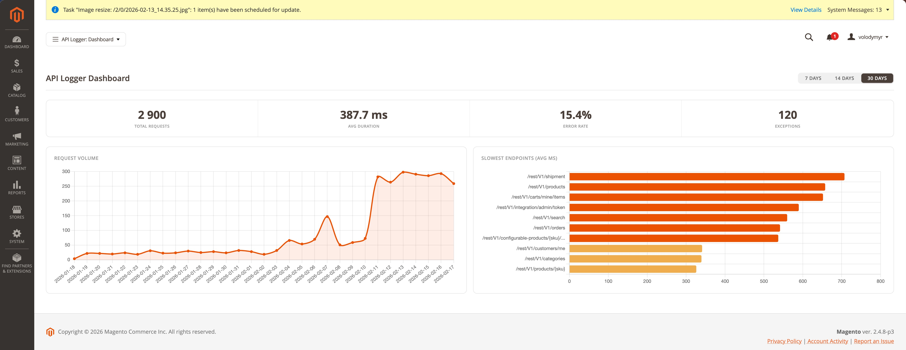
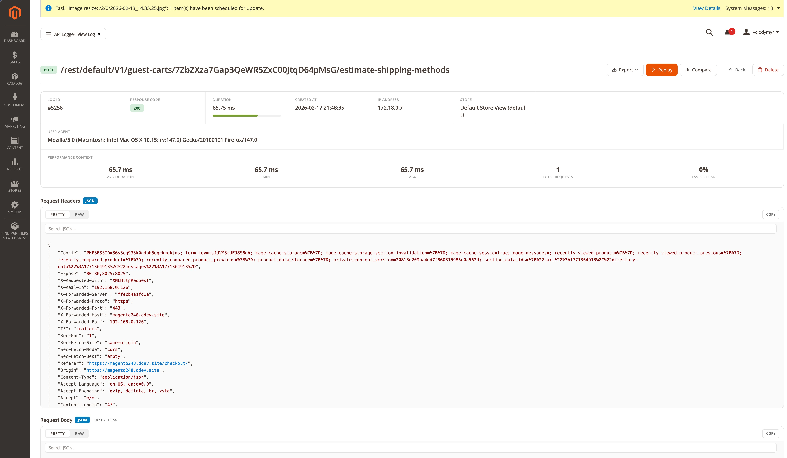
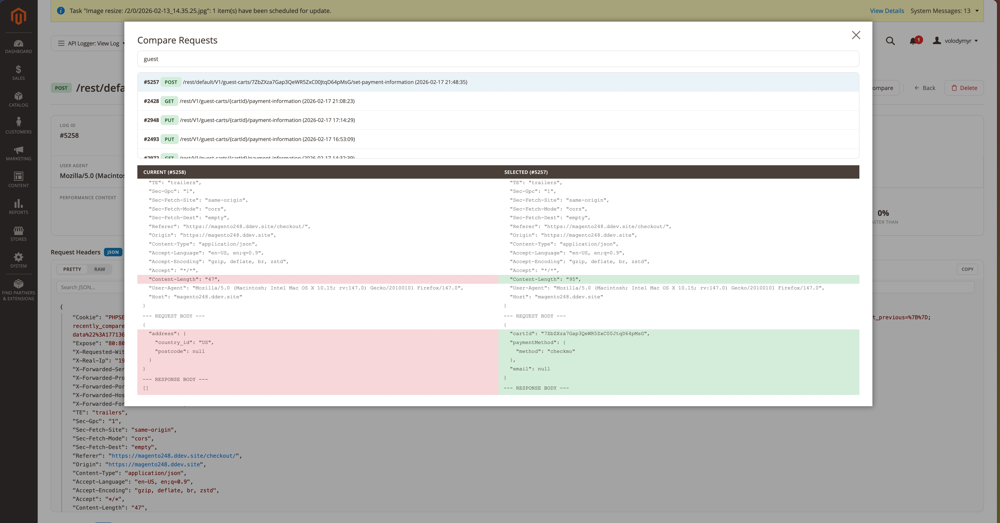

# Advanced API Logger for Adobe Commerce (Magento 2)

Enterprise API logging solution for Magento 2 with granular endpoint control, secret sanitization, analytics dashboard, request replay, and an advanced log viewer.

[](https://packagist.org/packages/hryvinskyi/magento2-api-logger)
[](https://packagist.org/packages/hryvinskyi/magento2-api-logger)
[](https://www.paypal.com/cgi-bin/webscr?cmd=_donations&business=volodymyr%40hryvinskyi%2ecom&lc=UA&item_name=Magento%202%20Advanced%20API%20Logger&currency_code=USD&bn=PP%2dDonationsBF%3abtn_donateCC_LG%2egif%3aNonHosted "Donate once-off to this project using Paypal")
[](https://packagist.org/packages/hryvinskyi/magento2-api-logger)
[](https://packagist.org/packages/hryvinskyi/magento2-api-logger)

## Screenshots

### Dashboard
Real-time analytics with request volume charts, slowest endpoints, error rate, and summary cards. Supports 7 / 14 / 30 day period switching.



### Log Detail View
Full request/response inspection with formatted JSON, syntax highlighting, performance metrics, query parameters, and quick actions.



### Compare & Replay
Side-by-side comparison of two log entries and request replay for debugging.



## Features

- **Granular Endpoint Control** — whitelist specific REST API endpoints with pattern-based matching and per-endpoint HTTP method filtering
- **Selective Response Code Logging** — choose which HTTP status codes to capture (200, 400, 401, 404, 500, etc.)
- **Secret Sanitization** — automatic detection and hashing of sensitive fields (passwords, tokens, API keys, card numbers) with customizable field list
- **Analytics Dashboard** — request volume over time, top 10 slowest endpoints, error rate, exception count with 7/14/30 day period views
- **Advanced Log Viewer** — formatted JSON with syntax highlighting, query parameter extraction, content-type badges, body size display, and status code badges
- **Request Replay** — re-execute original API requests and compare response status, duration, and body against the original
- **Compare Mode** — side-by-side comparison of any two log entries with related endpoint search
- **Export** — download logs as HAR (HTTP Archive) or raw HTTP (RFC 7230) format
- **Performance Metrics** — per-endpoint statistics including avg/min/max duration, request count, and percentile rank
- **Automatic Cleanup** — cron-based retention policy with configurable period and batch deletion
- **Admin Grid** — sortable, filterable listing with mass delete, column bookmarks, and date range filters
- **Multi-Store Support** — store-scoped logging configuration with store name display in log viewer

## Requirements

- PHP 8.1 or higher
- Magento 2.4.x (Open Source or Adobe Commerce)
- `hryvinskyi/magento2-base` module

## Installation

### Via Composer (recommended)
```bash
composer require hryvinskyi/magento2-api-logger
bin/magento module:enable Hryvinskyi_ApiLogger
bin/magento setup:upgrade
bin/magento cache:flush
```

### Manual Installation
1. Download the module from GitHub
2. Place it in `app/code/Hryvinskyi/ApiLogger`
3. Run:
```bash
bin/magento module:enable Hryvinskyi_ApiLogger
bin/magento setup:upgrade
bin/magento cache:flush
```

## Configuration

Navigate to **Stores > Configuration > Hryvinskyi Extensions > API Logger**

### General Settings
| Option | Description | Default |
|--------|-------------|---------|
| Enable API Logging | Master on/off switch | Disabled |
| Enabled Endpoints | Select which endpoints to log (grouped selector with search) | All |
| Enabled Response Codes | Select specific HTTP response codes to log | All |
| Log Request Headers | Include HTTP request headers in log | Yes |
| Log Request Body | Include request payload in log | Yes |
| Log Response Headers | Include HTTP response headers in log | Yes |
| Log Response Body | Include response payload in log | Yes |

### Security & Sanitization
| Option | Description | Default |
|--------|-------------|---------|
| Sanitize Sensitive Data | Automatic secret field detection and hashing | Enabled |
| Secret Field Names | Comma-separated list of field patterns to treat as secrets | password, token, authorization, api_key, secret, access_token, refresh_token, private_key, client_secret, card_number, cvv, ssn |

### Cleanup & Retention
| Option | Description | Default |
|--------|-------------|---------|
| Enable Automatic Cleanup | Cron job to delete old logs (daily at 2:00 AM) | Enabled |
| Retention Period | Days to keep logs before automatic deletion | 30 |

## Usage

### Dashboard

Navigate to **System > Tools > API Logger > Dashboard** to view analytics:

- **Summary Cards** — total requests, average duration, error rate, and exception count
- **Request Volume Chart** — line chart showing daily request count over the selected period
- **Slowest Endpoints Chart** — horizontal bar chart with the top 10 slowest endpoints by average duration (color-coded: green < 100ms, yellow < 500ms, orange < 1000ms, red >= 1000ms)
- **Period Selector** — switch between 7, 14, and 30 day views

### Viewing Logs

Navigate to **System > Tools > API Logger > Logs**:

1. Use grid filters to find specific logs by endpoint, method, response code, IP address, or date range
2. Click **View** on any entry to open the detail view
3. Detail view provides:
   - Formatted JSON request/response with syntax highlighting and search
   - Query parameters extracted from endpoint URL
   - Performance metrics (duration, percentile rank among similar endpoints)
   - Content-type and body size badges
   - Related log entries for the same endpoint

### Replay Requests

From the log detail view, click **Replay** to:

1. Re-execute the original API request with the same method, headers, and body
2. Compare original vs. replayed response status code and duration
3. Inspect the full replay response body

### Compare Entries

From the log detail view, click **Compare** to:

1. Search for related log entries by endpoint pattern
2. Select an entry for side-by-side comparison
3. Review differences in status codes, durations, headers, and response bodies

### Export Logs

From the log detail view, use the export dropdown to download:

- **HAR Format** — standard HTTP Archive format compatible with browser dev tools and analysis tools
- **Raw HTTP** — plain text RFC 7230 format showing the full request and response

### Managing Logs

- **Delete Single** — delete button in grid row or detail view
- **Mass Delete** — select multiple entries in the grid and use the mass delete action
- **Automatic Cleanup** — configure retention period in settings; cron runs daily at 2:00 AM

## ACL Resources

| Resource | Description |
|----------|-------------|
| `Hryvinskyi_ApiLogger::api_logger` | Main module access |
| `Hryvinskyi_ApiLogger::dashboard` | View dashboard |
| `Hryvinskyi_ApiLogger::logs` | View and manage logs |
| `Hryvinskyi_ApiLogger::replay` | Replay API requests |
| `Hryvinskyi_ApiLogger::delete` | Delete log entries |
| `Hryvinskyi_ApiLogger::config` | Module configuration |

## Technical Details

### How It Works

The module uses a Magento plugin on `Magento\Webapi\Controller\Rest::dispatch` to intercept REST API requests and responses. The plugin:

1. Captures request data (endpoint, method, headers, body, IP, user agent) in `beforeDispatch`
2. Captures response data (status code, headers, body) and measures duration in `afterDispatch`
3. Matches the endpoint against configured whitelist patterns
4. Sanitizes sensitive fields if enabled
5. Persists the log entry to the `hryvinskyi_api_log_entry` database table

### Database Table

**Table:** `hryvinskyi_api_log_entry`

| Column | Type | Description |
|--------|------|-------------|
| entity_id | INT (PK) | Auto-increment primary key |
| endpoint | VARCHAR(512) | API endpoint path |
| method | VARCHAR(10) | HTTP method |
| request_headers | MEDIUMTEXT | JSON-encoded request headers |
| request_body | MEDIUMTEXT | Request payload |
| response_headers | MEDIUMTEXT | JSON-encoded response headers |
| response_body | MEDIUMTEXT | Response payload |
| response_code | SMALLINT | HTTP response status code |
| duration | DECIMAL(10,4) | Request duration in milliseconds |
| is_exception | BOOLEAN | Whether an exception occurred |
| store_id | INT | Associated store ID |
| ip_address | VARCHAR(45) | Client IP address (IPv4/IPv6) |
| user_agent | VARCHAR(512) | Client user agent string |
| created_at | TIMESTAMP | Entry creation timestamp |

Indexed columns: `endpoint`, `method`, `response_code`, `is_exception`, `created_at`, `store_id`

## Author

**Volodymyr Hryvinskyi**
- Email: volodymyr@hryvinskyi.com
- GitHub: https://github.com/hryvinskyi

## License

This module is licensed under the [MIT License](LICENSE).

## Support

For issues, feature requests, or questions, please contact the author or submit an issue on GitHub.
